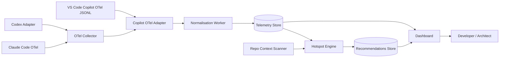
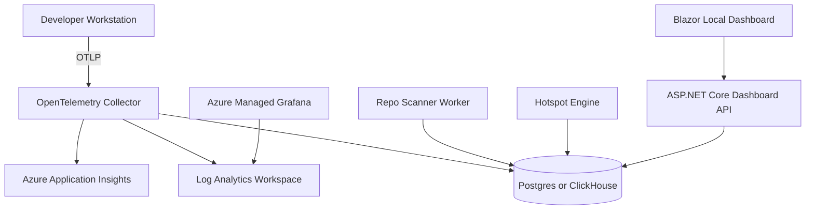

# Idea: AI Agent Token Burn Observatory

Status: historical ideation. This document is not the Azure Production MVP implementation source of truth.

The active production direction is defined by [Azure Production MVP PRD](../../prd/azure-production-mvp.md), [Production Target State Spec](../../specs/production-target-state.md), and [ADR 0002](../../adr/0002-replace-local-first-with-azure-production-saas.md). Use this idea document only as background context for product concepts that survived the production pivot.

## Working repo name

`ai-agent-token-observability`

## One-line pitch

A production-style observability platform that ingests telemetry from AI coding agents such as VS Code Copilot, Claude Code, and Codex, normalises token usage across harnesses, and identifies the files, tools, prompts, specs, MCP calls, and agent behaviours causing token burn.

## Elevator pitch

AI coding agents are becoming part of serious software delivery, but most teams cannot answer basic operational questions:

* Which agent sessions are burning the most tokens?
* Which repos are expensive to work on?
* Are tokens being spent on useful reasoning or repeated context bloat?
* Are cached tokens working, or are prompts constantly invalidating the cache?
* Are specs, instructions, MCP tools, terminal logs, and subagents causing hidden cost?
* Which optimisation would reduce token usage without reducing coding quality?

This repo builds a token observability and optimisation system for AI coding agents. It uses OpenTelemetry where available, vendor usage APIs where needed, and repo-context analysis to identify token hotspots and produce actionable recommendations. The dashboard is the inspection surface, not the product boundary.

## Why this repo matters

AI coding agents are no longer toy assistants. They are starting to behave like distributed systems:

* They have sessions.
* They call tools.
* They read large amounts of context.
* They invoke subagents.
* They retry failed work.
* They generate traces.
* They create cost.
* They need governance.

Most teams track cloud cost, API latency, failed requests, and database usage. But they do not track agent context burn, prompt-cache efficiency, reasoning-token usage, or token waste caused by poor repo structure.

This project treats AI coding agents as production workloads that need observability, FinOps, security, optimisation, and operational discipline.

## Target audience

* AI Platform Engineers
* AI Architects
* Azure Architects
* Developer Productivity teams
* Platform Engineering teams
* Engineering managers adopting coding agents
* FinOps teams managing AI spend
* Security teams concerned about prompt and code telemetry

## Core scenario

A team uses multiple coding agents across engineering workflows:

* VS Code Copilot agent mode
* Claude Code
* Codex
* MCP tools
* repo instructions
* spec-driven development artifacts
* long-lived design documents
* terminal commands
* automated tests
* pull request generation

Over time, the repo accumulates:

* many superseded specs
* large instruction files
* verbose tool outputs
* repeated terminal logs
* long diffs
* stale design documents
* duplicated context across subagents
* unnecessary MCP calls
* low prompt-cache reuse

The dashboard helps the team answer:

> Where are we burning tokens, why is it happening, and what should we change first?

## Problem statement

AI coding agents consume tokens in ways that are difficult to attribute. Vendor dashboards may show aggregate usage, but they usually do not explain why tokens were consumed or which repo artifact caused the burn.

This creates several problems:

1. Teams cannot distinguish useful token spend from waste.
2. Expensive sessions are hard to debug.
3. Prompt-cache misses are invisible.
4. Large specs and instruction files quietly become permanent tax.
5. Tool and MCP responses can flood context.
6. Subagents can multiply duplicated context.
7. Retry loops can repeatedly feed the same failure output back into the model.
8. There is no standard way to compare Claude, Copilot, Codex, and other harnesses.
9. Cost optimisation becomes guesswork.

## Architecture goals

The platform should:

1. Ingest telemetry from multiple AI coding-agent harnesses.
2. Normalise token metrics into a common schema.
3. Track token usage by session, turn, model, repo, branch, tool, MCP server, and context source.
4. Separate input, output, cached, cache-creation, and reasoning tokens where available.
5. Identify token hotspots and suspected causes.
6. Recommend practical optimisations.
7. Support local-first development.
8. Support Azure-hosted observability deployment.
9. Make telemetry privacy controls explicit.
10. Be useful even when some harnesses provide incomplete metrics.
11. Avoid requiring enterprise access for the MVP.
12. Treat full Azure Container Apps deployment as a later production path.

## Non-goals

This repo will not:

* Replace vendor billing dashboards.
* Claim perfect token attribution where providers do not expose enough detail.
* Capture full prompt/code content by default.
* Optimise model quality automatically.
* Train or fine-tune models.
* Build a generic LLM gateway.
* Depend on one vendor-specific telemetry format.

## Harnesses in scope

### P0: VS Code Copilot OTel adapter

Primary MVP source.

Expected data:

* session ID
* conversation ID
* model
* repo
* branch
* commit
* input tokens
* output tokens
* cache-read tokens when available
* cache-creation tokens when available
* reasoning tokens when available
* tool calls
* MCP tool/server names
* latency
* errors
* turn count
* accepted edits where available

### P2: Claude Code OTel adapter

High-value second source.

Expected data:

* session ID
* model
* input tokens
* output tokens
* cache-read tokens
* cache-creation tokens
* cost
* duration
* tool usage
* MCP attribution
* skill/agent metadata where available

### P2: Codex adapter

Support depends on execution mode.

Possible sources:

* local logs
* OpenAI API usage objects
* OpenAI organisation usage API
* OTEL if available through wrapper/harness
* session exports if exposed

Expected data:

* session ID where available
* model
* input tokens
* output tokens
* cached tokens
* reasoning tokens where available
* cost where available
* repo attribution if available


## Key design principle

Do not build a vendor-specific dashboard.

Build a common observability model:

```text
agent_session
agent_turn
model_invocation
tool_call
context_source
token_usage
hotspot
recommendation
```

Each vendor or harness becomes an adapter.

## System context



## Proposed Azure architecture



## Core dashboard views

### 1. Executive summary

Show:

* total sessions
* observed token total
* estimated token total
* mixed token total only when observed and estimated values are combined
* estimated cost
* input/output/cached/reasoning split
* cache hit ratio
* most expensive harness
* most expensive repo
* most expensive model
* top 5 hotspots
* top 5 optimisation recommendations

### 2. Harness comparison

Compare:

* Copilot vs Claude vs Codex
* session count
* average observed tokens per session
* average estimated tokens per session where observed values are unavailable
* P50/P95 token usage
* P50/P95 latency
* cache-read ratio
* reasoning-token ratio
* tool-call count
* failed session rate

### 3. Session explorer

For each session:

* harness
* repo
* branch
* model
* start/end time
* total turns
* observed token total
* estimated token total
* token total type
* input tokens
* output tokens
* cached tokens
* reasoning tokens
* cost
* tools used
* top context contributors
* suspected waste signals

### 4. Hotspot explorer

Rank token burn by:

* file
* folder
* spec
* instruction file
* MCP server
* MCP tool
* terminal command
* subagent
* model
* branch
* repo

Example output:

| Rank | Hotspot                    | Source Type | Tokens | Attribution | Suspected Cause                 | Recommendation                      |
| ---: | -------------------------- | ----------- | -----: | ----------- | ------------------------------- | ----------------------------------- |
|    1 | `/specs/legacy/`           | Folder      |   1.8M | Correlated  | Superseded specs still included | Add active spec index               |
|    2 | `terraform plan`           | Tool output |   920K | Direct      | Full plan returned repeatedly   | Summarise plan before agent sees it |
|    3 | `AGENTS.md`                | Instruction |   480K | Direct      | Large static prompt             | Split into skill frontmatter        |
|    4 | `test output`              | Terminal    |   390K | Direct      | Retry loop                      | Collapse logs to failing tests      |
|    5 | `security-review subagent` | Subagent    |   310K | Inferred    | Duplicated context              | Narrow subagent scope               |

### 5. Prompt-cache view

Show:

* total input tokens
* cache-read tokens
* cache-creation tokens
* cache-hit ratio
* cache-miss-heavy sessions
* files or prompt sections causing cache churn
* changed files before expensive cache misses
* recommendations for stable-prefix design

### 6. Repo context bloat view

Scan the repository and identify:

* largest markdown files
* largest specs
* number of superseded specs
* instruction files
* duplicated sections
* files likely included by default
* MCP config files
* agent skill files
* stale design docs
* generated files accidentally visible to agents

### 7. Tool and MCP cost view

Show:

* most expensive tools
* most frequent tools
* tool result token size
* average tool latency
* failed tool calls
* repeated tool calls
* MCP server contribution
* tool outputs that should be summarised or paginated

### 8. Optimisation backlog

Generate actionable backlog items:

* reduce instruction file size
* introduce active spec index
* archive superseded specs
* cap MCP tool output
* summarise terminal logs
* split repo guidance by task type
* move stable context earlier
* reduce subagent fan-out
* use cheaper model for low-risk tasks
* add retry budget
* add context budget policy

## Normalised data model

### `agent_session`

```text
session_id
harness
workspace_id
started_at
ended_at
duration_ms
user_hash
identity_mapping_enabled
ide_or_cli
agent_version
```

### `developer_identity_mapping`

May be populated when explicit import or enrichment input, a configured mapping source, or clearly emitted telemetry provides a Developer Display Label. Do not silently scrape Git config, OS users, shell environment, or unrelated local files for identity data.

```text
identity_mapping_id
user_hash
display_name
email_hash
team_name
department_name
mapping_source
enabled_for_environment
created_at
```

### `workspace_repo`

```text
workspace_repo_id
workspace_id
session_id
repo_name
repo_path
repo_path_hash
repo_path_capture_enabled
branch
commit_sha
remote_url_hash
is_primary
attribution_confidence
```

`repo_path` is nullable. The default identifier for path-level grouping is `repo_path_hash`; Repo Display Paths may be stored when explicitly supplied by import or enrichment input or clearly emitted telemetry. Content Capture Mode remains separate and disabled by default.

### `agent_turn`

```text
turn_id
session_id
timestamp
turn_index
model_requested
model_resolved
mode
input_tokens
output_tokens
cache_read_tokens
cache_creation_tokens
reasoning_tokens
observed_total_tokens
estimated_total_tokens
mixed_total_tokens
token_total_type
input_tokens_status
output_tokens_status
cache_read_tokens_status
cache_creation_tokens_status
reasoning_tokens_status
token_metric_confidence
estimated_cost_usd
latency_ms
success
error_type
retry_count
```

### `tool_call`

```text
tool_call_id
turn_id
tool_name
mcp_server_name
started_at
ended_at
duration_ms
success
input_size_chars
output_size_chars
estimated_output_tokens
content_captured
```

### `context_source`

```text
context_source_id
turn_id
source_type
path_or_name
file_category
estimated_tokens
actual_tokens_if_available
token_status
included_by_default
cacheable
changed_since_previous_turn
repeated_across_turns
eligible_for_inferred_hotspot
confidence
```

Token metrics must use `NULL` for unavailable values. Zero is reserved for known observed zero values. Each nullable token metric must have a status field such as `observed`, `estimated`, `unavailable`, or `not_applicable`, plus a confidence value where attribution is inferred. Dashboards must not show an unqualified total token number; they must distinguish observed, estimated, and mixed token totals.

### `hotspot`

```text
hotspot_id
scope_type
workspace_id
workspace_repo_id
repo_name
harness
source_type
path_or_name
file_category
token_burn
estimated_cost_usd
sessions_impacted
turns_impacted
attribution_type
evidence_summary
evidence_refs
suspected_cause
confidence
recommendation
```

Only hotspots with `attribution_type = direct` may be described as proven. Correlated and inferred hotspots must be presented as suspected causes with visible evidence and confidence.
Hotspots should attach to `workspace_repo_id` when repo attribution is clear. Ambiguous multi-root attribution should use `scope_type = workspace` and leave `workspace_repo_id` unset.
Generated files, lockfiles, vendor files, binaries, and build artifacts should be marked with `file_category` and excluded from correlated or inferred hotspot attribution by default. If harness telemetry directly references one of these files, keep the hotspot with `attribution_type = direct` and label the file category in the dashboard.

### `recommendation`

```text
recommendation_id
hotspot_id
recommendation_type
rule_id
trigger_condition
recommended_action
expected_benefit
evidence_refs
confidence
llm_prompt_version
llm_model
llm_generated_text
llm_review_status
created_at
```

The Local-First MVP must generate only deterministic recommendations. LLM-assisted recommendation text is reserved for the Azure Production Path and must be grounded in existing hotspot evidence, deterministic recommendations, and policy constraints.

## Hotspot detection rules

### Rule 1: Large repeated instruction file

Detect when the same instruction file appears in many sessions and contributes high input tokens.

Recommendation:

* split into smaller task-specific instructions
* move rarely used details into referenced docs
* create skill frontmatter rather than loading full detail by default

### Rule 2: Superseded spec bloat

Detect many specs with similar names, dates, or statuses where old specs are still visible.

Recommendation:

* create `active-specs.md`
* mark old specs as superseded
* exclude archived specs from default agent context
* add frontmatter status metadata

### Rule 3: Poor prompt-cache efficiency

Detect sessions with high input tokens and low cache-read tokens.

Recommendation:

* keep stable instructions first
* move volatile data later
* avoid timestamps in stable prompt sections
* avoid rewriting large instruction files unnecessarily

### Rule 4: Verbose tool output

Detect tool calls whose output size dominates the following model invocation.

Recommendation:

* return summaries by default
* expose full output behind explicit follow-up
* paginate MCP results
* cap terminal output
* extract errors and warnings first

### Rule 5: Retry loop burn

Detect repeated failed tool calls or repeated terminal errors.

Recommendation:

* stop after retry budget
* summarise repeated failures
* change strategy before another attempt
* add failure classifier

### Rule 6: Subagent fan-out waste

Detect many subagents receiving similar large context.

Recommendation:

* narrow subagent scope
* pass only task-specific files
* avoid duplicating entire repo context
* use cheaper model for low-risk analysis

### Rule 7: Large diff burn

Detect repeated full-diff inclusion.

Recommendation:

* include only changed hunks
* summarise generated files
* exclude lock files, generated files, vendor files, binaries, and build artifacts from default context
* use path-based filtering

Attribution guardrail:

* generated files, lockfiles, vendor files, binaries, and build artifacts can contribute to repo context metrics
* they must not become correlated or inferred hotspots by default
* direct harness references remain visible as direct hotspots with file category labels

### Rule 8: MCP over-fetching

Detect MCP tools returning large unfiltered result sets.

Recommendation:

* require query filters
* add result limits
* add server-side summarisation
* log returned row counts and token estimates

## Security and privacy model

This repo must be designed with privacy-first defaults.

### Default behaviour

* Do not capture full prompts.
* Do not capture full code files.
* Do not capture full tool results.
* Do not capture full command outputs.
* Store developer identity as `user_hash` by default.
* Allow real developer display labels when they are provided by explicit import input, configured mapping, or clearly emitted telemetry.
* Do not silently scrape Git config, OS users, shell environment, or unrelated local files for identity data.
* Store repo paths as `repo_path_hash` by default.
* Allow repo display paths when they are explicitly supplied by import or enrichment input or clearly emitted telemetry.
* Do not silently scrape unrelated local files for repo paths.
* Allow friendly repo names for dashboard readability.
* Store only token counts, span metadata, timings, and attribution fields.
* Allow local-only mode.

### Content Capture Mode

Content Capture Mode is explicit opt-in and disabled by default. It is allowed only for approved local debugging or synthetic demo data where the operator controls the content.

When enabled:

* require an explicit configuration flag
* show capture status in the dashboard
* capture prompt snippets
* capture tool results
* capture file paths
* capture command outputs
* capture file content snippets only when explicitly requested
* use redaction before storage
* record whether redaction succeeded
* mark captured content as synthetic, local, or private
* block content capture for public demo runs unless the dataset is synthetic

### Redaction rules

Redact:

* secrets
* API keys
* connection strings
* bearer tokens
* private keys
* passwords
* email addresses
* customer names
* tenant IDs if configured
* proprietary code snippets if configured

## Cost considerations

The platform should track both:

1. **Observed token burn**
2. **Cost of observability itself**

For the Local-First MVP, Token Burn ranking is required and dollar cost estimation is optional. `estimated_cost_usd` should remain nullable, cost should be shown only when a pricing table is configured, and dashboards must label it as estimated rather than billed. The MVP must not claim equivalence with vendor billing dashboards.

Cost dimensions:

* Application Insights ingestion
* Log Analytics retention
* dashboard hosting
* database storage
* OTel collector compute
* optional ClickHouse/Postgres cost
* token estimation worker cost
* repository scanning cost

Design choices:

* Azure mode for production-style portfolio demo
* sampling for high-volume teams
* content capture off by default
* retention policies for raw traces
* aggregated tables for long-term reporting

## Performance considerations

The system should handle:

* many sessions per day
* large OTEL JSONL exports
* high-cardinality labels such as repo, branch, model, tool, and session
* large tool result metadata
* incremental repo scans
* dashboard queries over many events

Performance design:

* separate raw events from aggregated facts
* precompute session summaries
* precompute hotspot summaries
* store raw traces separately
* avoid putting high-cardinality dimensions directly into expensive metrics systems unless needed
* use columnar storage where useful

## Observability for this platform

The observability platform itself should expose:

* ingestion event count
* failed normalisation count
* adapter error count
* unsupported schema count
* unknown token metric count
* hotspot engine duration
* dashboard query latency
* database write latency
* redaction failure count
* dropped event count

## Failure modes

| Failure Mode                                 | Impact                       | Mitigation                            |
| -------------------------------------------- | ---------------------------- | ------------------------------------- |
| Provider does not emit reasoning tokens      | Incomplete reasoning view    | Mark metric as unavailable, not zero  |
| Provider changes OTEL schema                 | Adapter breaks               | Schema versioning and contract tests  |
| Content capture leaks sensitive data         | Security incident            | Off by default, redaction, local mode |
| OTel collector unavailable                   | Lost events                  | File exporter fallback                |
| High-cardinality labels explode cost         | Observability bill increases | Aggregation and label allowlist       |
| Token estimates differ from provider billing | Confusing reports            | Separate actual vs estimated tokens   |
| Copilot org metrics lack session detail      | Weak attribution             | Use VS Code OTel for session view     |
| Codex logs unavailable                       | Partial support              | API usage adapter and wrapper mode    |
| Repo scanner over-reports files              | False hotspots               | Confidence score and human review     |
| Dashboard becomes vanity metrics             | Low value                    | Always show recommendation backlog    |

## Testing strategy

### Unit tests

* parse Copilot OTel events
* parse Claude Code events
* normalise token fields
* calculate cache-hit ratio
* detect hotspot rules
* redact sensitive data
* estimate tokens from text length
* handle missing fields safely

### Integration tests

* ingest sample OTel JSONL
* run collector locally
* write to PostgreSQL
* generate session summary
* generate hotspot recommendations
* render dashboard views

### Golden datasets

Create sample traces for:

* normal low-cost session
* expensive spec-bloat session
* poor cache-hit session
* verbose MCP output session
* retry-loop session
* subagent fan-out session
* missing reasoning-token session
* missing cached-token session

### Evaluation tests

The hotspot engine should be evaluated against labelled examples:

```text
Input: trace + repo snapshot
Expected hotspot: superseded specs
Expected recommendation: create active spec index
```

## Demo scenarios

### Primary MVP use case: Spec-driven development bloat

Use the Spec Kit Spec-Bloat Scenario to define the primary spec-bloat use case. Use the Manual Spec Kit Spec-Bloat Demo Runbook to exercise it during presentation.

The use case creates or preserves:

* active current feature spec, plan, and tasks
* old specs
* superseded specs
* old plans
* completed task files
* stale design logs
* duplicate generated artifacts
* active specs
* large design logs

Show:

* token burn from outdated specs
* attribution type and confidence for the suspected hotspot
* evidence references from telemetry and repo context enrichment
* the stale spec artifact set as the primary hotspot
* recommendation to create `active-specs.md`, move superseded specs under `specs/archive/`, and configure agent instructions to load only active specs by default
* expected benefit: reduce repeated context from stale specs and plans, preserve audit history by archiving instead of deleting, and make the current spec workflow explicit to the agent

Goal:

* demonstrate the full Optimization Feedback Loop without requiring multiple harnesses or Azure deployment

Spec Kit Spec-Bloat Scenario:

* run Spec Kit manually to create or evolve specs for an internal deployment approval tracker
* include iterations for manual approvals, Slack notifications, Azure environment gates, audit logs, RBAC, and emergency override
* leave old specs and plans visible after the current workflow changes
* run telemetry capture while Copilot works against the repo with stale Spec Kit artifacts visible
* import the captured telemetry into the observability app
* run Repo Context Enrichment against the same repo
* show the resulting spec-bloat Token Hotspot and recommendation
* document the scenario in `docs/archive/demos/spec-kit-spec-bloat.md`
* document the live demo flow in `docs/archive/demos/manual-spec-kit-spec-bloat.md`

Manual Spec Kit artifact classification:

* active context: current feature spec, current plan, current tasks, and project principles or constitution if present
* bloat: superseded feature specs, old plans, completed task files, stale design logs, duplicate generated artifacts, and archived specs still visible to the agent
* neutral context: generated task breakdowns or checklists that are not currently referenced; they count toward repo context size but should not become hotspots unless repeated or visible in the expensive session

### P2 demo: Token burn by harness

Show Copilot, Claude, and Codex sessions side by side.

Goal:

* demonstrate normalised cross-agent observability

### Additional demo: MCP tool output burn

Create an MCP tool that returns too much data.

Show:

* tool output dominates model input
* recommendation to paginate or summarise output

### Additional demo: Prompt-cache miss

Create a large instruction file with changing timestamp at the top.

Show:

* low cache-read ratio
* recommendation to move volatile content later

### Additional demo: Retry loop

Create failing test command that agent retries repeatedly.

Show:

* repeated logs
* token waste
* recommendation to summarise error and stop after retry budget

### Additional demo: Subagent fan-out

Create multiple subagents reviewing the same large context.

Show:

* duplicated context across subagents
* recommendation to pass narrow context

## Repository structure

```text
/
├── README.md
├── docs
│   ├── ideas
│   │   └── IDEA-ai-agent-token-observability.md
│   ├── architecture
│   │   ├── system-context.md
│   │   ├── local-architecture.md
│   │   ├── azure-architecture.md
│   │   ├── data-model.md
│   │   └── copilot-otel-field-mapping.md
│   ├── adr
│   │   ├── 0001-use-dotnet-aspire-and-blazor-for-local-first-mvp.md
│   │   ├── 0002-use-opentelemetry-as-ingestion-standard.md
│   │   ├── 0003-normalise-vendor-token-metrics.md
│   │   ├── 0004-privacy-first-content-capture.md
│   │   ├── 0005-use-local-postgresql-for-local-mvp.md
│   │   ├── 0006-hotspot-confidence-scoring.md
│   │   └── 0007-azure-observability-deployment.md
│   ├── tradeoffs
│   │   ├── actual-vs-estimated-tokens.md
│   │   ├── content-capture-vs-privacy.md
│   │   ├── metrics-vs-traces.md
│   │   └── local-vs-cloud-mode.md
│   ├── security
│   │   ├── privacy-model.md
│   │   ├── redaction-rules.md
│   │   └── threat-model.md
│   ├── cost
│   │   ├── cost-model.md
│   │   └── azure-cost-estimate.md
│   ├── observability
│   │   ├── otel-schema.md
│   │   ├── kql-queries.md
│   │   └── grafana-dashboard.md
│   ├── runbooks
│   │   ├── missing-token-metrics.md
│   │   ├── otel-collector-down.md
│   │   └── high-ingestion-cost.md
│   └── demos
│       ├── demo-01-copilot-session-ingestion.md
│       ├── demo-02-spec-bloat-hotspot.md
│       ├── demo-03-mcp-output-burn.md
│       └── demo-04-cache-miss-analysis.md
├── infra
│   └── terraform
│       ├── local
│       └── azure
├── src
│   ├── apphost
│   ├── adapters
│   │   ├── copilot-vscode-otel
│   │   ├── claude-code-otel
│   │   ├── codex
│   │   └── generic-genai-otel
│   ├── normalizer
│   ├── repo-scanner
│   ├── hotspot-engine
│   ├── ingestion-worker
│   ├── dashboard-api
│   └── dashboard-blazor
├── tests
│   ├── unit
│   ├── integration
│   └── fixtures
├── evals
│   ├── golden-traces
│   ├── expected-hotspots
│   └── evaluation-report.md
├── scripts
│   ├── run-local-demo.sh
│   ├── generate-sample-traces.sh
│   └── scan-repo.sh
└── .github
    └── workflows
        ├── ci.yml
        ├── security.yml
        └── eval-hotspot-engine.yml
```

## Implementation phases

### Phase 0: Research spike

Goal:

Prove telemetry can be captured locally.

Tasks:

* enable VS Code Copilot OTel file export
* capture sample sessions
* inspect spans and attributes
* identify token fields
* classify Copilot OTel fields as documented, fixture-observed, optional when available, or content-capture-only
* document direct JSONL import path
* document planned OpenTelemetry Collector ingestion path
* document available and missing fields
* create first fixture file

Exit criteria:

* sample OTel trace committed under `tests/fixtures`
* `docs/archive/future-adapters/copilot-otel-field-mapping.md` documents field categories and normalized mappings
* known limitations listed

### Phase 1: Local ingestion MVP

Goal:

Parse OTel JSONL into a local database.

Tasks:

* create normalised schema
* create Aspire AppHost
* create ingestion worker project
* create dashboard API project
* create Blazor dashboard project
* build Copilot OTel parser
* build generic GenAI OTel parser
* keep adapter boundary compatible with later OpenTelemetry Collector input
* store results in local PostgreSQL
* generate session summary table
* generate basic Blazor dashboard

Exit criteria:

* local command imports telemetry
* Aspire starts PostgreSQL, ingestion worker, dashboard API, and Blazor dashboard together
* dashboard shows sessions and token split

### Phase 1.5: Local OpenTelemetry Collector path

Goal:

Add a local Collector ingestion path after direct JSONL import and the normalized schema are stable.

Tasks:

* add OpenTelemetry Collector resource to Aspire AppHost
* configure local OTLP/file receiver path
* route Collector output into the ingestion worker
* verify Collector-ingested telemetry maps to the same normalized schema

Exit criteria:

* direct JSONL import and Collector ingestion produce equivalent normalized records for the same fixture
* dashboard does not need separate views for direct-imported and Collector-ingested telemetry

### Phase 2: Hotspot engine MVP

Goal:

Identify token hotspots.

Tasks:

* implement repo scanner as enrichment, separate from telemetry ingestion
* implement large file detection
* implement repeated context detection
* implement tool output burn detection
* implement cache-hit analysis
* generate deterministic recommendation table

Exit criteria:

* dashboard shows top hotspots and recommendations
* hotspot records distinguish direct, correlated, and inferred attribution
* recommendations include rule id, trigger condition, evidence refs, confidence, recommended action, and expected benefit

## Local-First MVP acceptance criteria

The Local-First MVP is done when Phase 0, Phase 1, and Phase 2 pass together. Phase 1.5 Collector ingestion is excluded from MVP acceptance and remains a post-MVP maturity path.

Required acceptance outcomes:

* Copilot Field Mapping is documented before parser behavior is treated as stable.
* MVP parser acceptance uses committed Copilot JSONL fixtures for happy path and missing metrics coverage.
* Direct JSONL import populates the normalized PostgreSQL schema.
* Aspire starts the Local Pipeline Projects and Local Store together.
* The Local Dashboard shows imported sessions and token splits.
* Repo Context Enrichment runs separately from telemetry ingestion.
* Rule 2: Superseded spec bloat is the required MVP deterministic hotspot rule and produces a Token Hotspot.
* The primary spec-driven development bloat use case produces attribution type, confidence, evidence refs, recommendation, and expected benefit.
* Once implementation exists, the Manual Spec Kit Spec-Bloat Demo Runbook can be executed end to end.

Fixture acceptance contract:

* The happy path session includes session, turn, model, input tokens, output tokens, timing, and tool-call metadata.
* The missing metrics session omits at least one optional token metric and verifies the normalized value is `NULL` with metric status and confidence instead of zero.
* The live Spec Kit demo verifies Repo Context Enrichment, hotspot attribution, evidence refs, deterministic recommendation, and expected benefit.

Direct import acceptance contract:

* A repeatable CLI or worker command imports one JSONL file or a fixture directory.
* The command accepts a harness value, starting with `copilot`.
* The command accepts or derives workspace and repo identity.
* Re-importing the same fixture is idempotent or explicitly replaces the previous import.
* The command reports imported sessions, turns, tool calls, skipped records, warnings, and errors.
* Malformed records do not crash the whole import; they are counted and surfaced.
* The command exits non-zero only for fatal import failures.

Normalized persistence acceptance contract:

* Each fixture import creates persisted `agent_session`, `agent_turn`, and `workspace_repo` records.
* Fixtures with tool calls create persisted `tool_call` records.
* Repo/context evidence creates persisted `context_source` records.
* The live Spec Kit demo import creates persisted `hotspot` and `recommendation` records when the captured telemetry and Repo Context Enrichment identify spec bloat.
* Unavailable token metrics are stored as `NULL`, never zero.
* Token metric status fields and `token_total_type` are populated.
* `user_hash` is present when developer identity is available; Developer Display Label may be present when explicitly supplied or mapped.
* `repo_path_hash` is present when repo path is available; repo display paths may be present when explicitly supplied.
* `context_source` records include `file_category` and `eligible_for_inferred_hotspot`.
* `hotspot` records include attribution type, confidence, and evidence refs.
* `recommendation` records include rule id, trigger condition, recommended action, expected benefit, confidence, and evidence refs.
* `estimated_cost_usd` is nullable and does not block MVP acceptance.

Local Dashboard MVP acceptance contract:

* Session list shows imported sessions with harness, repo friendly name, model, start time, turn count, token total type, observed total, estimated total, mixed total when applicable, and success or error status.
* Session detail shows turns, token split, unavailable metric statuses, tool calls, and context sources.
* Hotspot and recommendation view shows top Token Hotspots with source type, file category where relevant, attribution type, confidence, evidence refs, suspected cause, recommendation, and expected benefit.
* Sessions and hotspots can be ranked by Token Burn without dollar cost estimates.
* Dollar cost is shown only when a pricing table is configured, and is labelled estimated rather than billed.
* Harness comparison is deferred until Secondary Harness support.
* Dedicated prompt-cache and repo-context bloat views are post-MVP unless they are needed to support the primary spec-bloat use case.

MVP hotspot rule acceptance contract:

* Rule 2: Superseded spec bloat is the required MVP hotspot rule.
* The spec-bloat repo snapshot includes active, superseded, and old spec files.
* Repo Context Enrichment classifies those files as context sources.
* The primary hotspot is the stale spec artifact set, such as `specs/` or `specs/archive-candidate/`.
* The rule creates a hotspot with `source_type = spec` or a folder-level equivalent.
* The hotspot uses `attribution_type = correlated` or `attribution_type = inferred` unless harness telemetry directly references the spec.
* Confidence is populated.
* Evidence refs point to telemetry records, repo context records, or both.
* The recommendation says to create `active-specs.md`, move superseded specs under `specs/archive/`, and configure agent instructions to load only active specs by default.
* Expected benefit is populated.

MVP verification acceptance contract:

* Automated verification is required for MVP acceptance.
* Unit tests cover parser field mapping and missing metric handling.
* Integration tests import the parser fixtures into PostgreSQL and verify required normalized records.
* Manual demo verification runs Rule 2 against the live Spec Kit demo and verifies expected hotspot and recommendation fields.
* Privacy acceptance tests verify default metadata-only behavior.
* A local demo script starts the Aspire app and loads fixture data.
* End-to-end runbook verification confirms the Manual Spec Kit Spec-Bloat Demo Runbook can be completed against the implemented app.
* Manual dashboard inspection supports the demo but is not sufficient for MVP acceptance by itself.

MVP privacy acceptance contract:

* Full prompt text is not persisted.
* Full code file content is not persisted.
* Full tool results are not persisted.
* Full command outputs are not persisted.
* Raw developer identity is not persisted.
* Raw repo path is not persisted by default.
* `user_hash` is persisted.
* `repo_path_hash` is persisted.
* `content_captured = false` for default fixture imports.
* Content Capture Mode is disabled by default.
* Redaction tests are post-MVP unless Content Capture Mode is implemented in the MVP.

### Phase 3: Claude Code adapter

Goal:

Add second high-quality harness.

Tasks:

* ingest Claude Code OTel or exported telemetry
* map Claude token fields to common schema
* compare Claude and Copilot sessions
* document schema differences

Exit criteria:

* dashboard compares Copilot and Claude sessions

### Phase 4: Codex adapter

Goal:

Add Codex support with documented limitations.

Tasks:

* investigate available Codex telemetry/logs/API usage
* build adapter for available data source
* map usage fields to common schema
* add confidence levels

Exit criteria:

* Codex appears in harness comparison
* limitations are explicit

### Phase 5: Azure deployment

Goal:

Show production-ready architecture.

Tasks:

* deploy OTel Collector
* deploy storage
* deploy dashboard
* integrate Application Insights
* add Log Analytics queries
* add Grafana dashboard
* add Terraform

Exit criteria:

* Azure deployment can be reproduced
* cost model documented

### Phase 5.5: LLM-assisted recommendation path

Goal:

Add production-path LLM-assisted recommendation explanations without changing MVP hotspot detection semantics.

Tasks:

* add Azure AI Foundry or Azure OpenAI model deployment for recommendation drafting
* generate recommendation text only from existing hotspot evidence and deterministic recommendations
* store prompt version, model, input evidence refs, output text, and review status
* add guardrails to prevent unsupported new findings
* evaluate generated recommendations against golden hotspot examples

Exit criteria:

* LLM-assisted recommendations are traceable to deterministic recommendation records
* unsupported generated claims are rejected or marked for review
* users can distinguish deterministic recommendations from LLM-assisted text

### Phase 6: Portfolio hardening

Goal:

Make the repo documented

Tasks:

* write README
* add architecture diagrams
* add ADRs
* add threat model
* add cost model
* add runbooks
* add demo videos or scripts
* add evaluation report

Exit criteria:

* repo reads like a miniature production case study

## README outline

```text
# AI Agent Token Observability

## What problem does this solve?

## Why token observability matters for AI coding agents

## Supported harnesses

## Architecture

## Local demo

## Dashboard screenshots

## Data model

## Hotspot detection rules

## Security and privacy model

## Cost model

## Azure deployment

## Testing and evals

MVP testing must verify semantic correctness, not only successful rendering.

Required MVP tests:

* parser unit tests for Copilot field mapping
* parser unit tests for unavailable metric handling
* integration test for importing the happy path fixture
* integration test for importing the missing metrics fixture
* manual demo verification for the live Spec Kit spec-bloat path
* persistence assertions for required normalized records
* Rule 2: Superseded spec bloat verification during the live Spec Kit demo
* recommendation assertions for rule id, trigger condition, evidence refs, confidence, recommended action, and expected benefit
* privacy assertions for metadata-only default behavior

Required MVP demo automation:

* local demo script starts the Aspire app
* local demo script can load parser fixtures
* local demo script leaves the Local Dashboard ready to inspect imported sessions, token splits, hotspots, and recommendations

## Known limitations

## Production improvements

## Interview talking points
```

## Key ADRs to write

### ADR-001: Use .NET Aspire and Blazor for the Local-First MVP

Explain why the local app is .NET Aspire with Blazor, ASP.NET Core, an ingestion worker, and local PostgreSQL instead of Python Streamlit, Docker Compose only, or Next.js.

### ADR-002: Use OpenTelemetry as the ingestion standard

Explain why OTel is better than vendor-specific parsing as the primary interface.

### ADR-003: Normalise token usage across vendors

Explain actual vs estimated tokens, missing metrics, confidence levels, and provider differences.

### ADR-004: Privacy-first telemetry design

Explain why content capture is off by default.

### ADR-005: Use local PostgreSQL for the local MVP

Explain why local PostgreSQL keeps the local schema close to the production path while still avoiding cloud dependency.

### ADR-006: Use hotspot confidence scoring

Explain why recommendations should show confidence instead of pretending perfect attribution.

### ADR-007: Support Azure observability deployment

Explain how Application Insights, Log Analytics, Azure Managed Grafana, and Terraform demonstrate Azure architecture depth.

## What to build first

Build this first:

```text
VS Code Copilot OTel file export
        ↓
JSONL parser
        ↓
Normalised PostgreSQL schema
        ↓
Session summary
        ↓
Simple Blazor dashboard
        ↓
Top Token Hotspots with attribution, evidence, confidence, and deterministic recommendations
```

Do not start with multi-cloud, AKS, complex UI, or all three harnesses.

The first portfolio milestone should prove:

> I can capture AI coding-agent telemetry and turn it into evidence-backed optimization recommendations.

## What to document first

Document before heavy coding:

1. `IDEA-ai-agent-token-observability.md`
2. `docs/archive/local-first/local-first-mvp.md`
3. `system-context.md`
4. `data-model.md`
5. `0001-use-dotnet-aspire-and-blazor-for-local-first-mvp.md`
6. `0002-use-opentelemetry-as-ingestion-standard.md`
7. `0004-privacy-first-content-capture.md`
8. `actual-vs-estimated-tokens.md`
9. `demo-01-copilot-session-ingestion.md`

## Open questions for grill-me review

Use these to challenge the idea before converting to PRD:

1. Is the MVP too broad? Resolved: no, if the MVP is strictly limited to VS Code Copilot, Direct File Import, local PostgreSQL, deterministic recommendations, metadata-only defaults, and the Blazor Local Dashboard. Additional harnesses, including Claude Code and Codex, are P2.
2. Should Claude Code or VS Code Copilot be the first harness? Resolved: VS Code Copilot is the Primary Harness, Claude Code is the first Secondary Harness once the normalized schema works, and Codex is a later Secondary Harness.
3. Should the first dashboard be Streamlit, Grafana, or Next.js? Resolved: Blazor Web App for the Local-First MVP, Grafana for the Azure Production Path, and no Streamlit or Next.js dashboard.
4. Is DuckDB enough for local MVP? Resolved: no. Use local PostgreSQL for the Local-First MVP.
5. What exact Copilot OTel fields are guaranteed vs optional? Resolved: Phase 0 must produce `copilot-otel-field-mapping.md` with documented, fixture-observed, optional when available, and content-capture-only categories.
6. How should unavailable metrics be represented? Resolved: store unavailable token metrics as `NULL`, never zero, with metric status and confidence.
7. How do we avoid pretending estimated tokens are actual billed tokens? Resolved: separate observed, estimated, and mixed token totals, and label every dashboard aggregate with token total type.
8. How much content capture is acceptable for a public demo? Resolved: metadata-only by default. Content Capture Mode is available only as explicit opt-in with redaction and approved local or synthetic demo data.
9. Should repo scanning be separate from telemetry ingestion? Resolved: yes. Repo scanning is enrichment, not ingestion, and scanner findings must be lower-confidence than harness-emitted telemetry.
10. How will the hotspot engine prove that a file caused token burn? Resolved: only direct attribution is proof. Correlated and inferred hotspots must be labelled as suspected and include evidence plus confidence.
11. What is the minimum useful recommendation engine? Resolved: MVP uses deterministic rule-based recommendations only. The Azure Production Path plans LLM-assisted recommendation text grounded in existing evidence.
12. How will this handle multi-root VS Code workspaces? Resolved: model `workspace_repo` records per session and attach ambiguous hotspots at workspace scope rather than forcing repo attribution.
13. How will it handle multiple developers? Resolved: use `user_hash` for stable attribution, allow Developer Display Labels from explicit input, configured mappings, or clearly emitted telemetry, and defer richer Work Family modeling to later phases.
14. How will it handle private repo paths? Resolved: store `repo_path_hash` for stable grouping, allow Repo Display Paths from explicit import or enrichment input or clearly emitted telemetry, and keep content capture opt-in and disabled by default.
15. How will it handle generated files and lock files? Resolved: classify files by category, exclude generated files and lockfiles from correlated or inferred hotspot attribution by default, but keep direct harness references visible as direct hotspots.
16. Should it support OpenTelemetry Collector from day one? Resolved: no. Start with direct JSONL import, but add a planned Collector ingestion path after the parser and schema are stable.
17. Should Azure deployment be P1 or P2? Resolved: P2. Prove the observability model locally first; Azure deployment comes after the normalized schema, local ingestion, dashboard, and deterministic hotspot engine are working.
18. What makes this more than a dashboard? Resolved: the MVP must include the Optimization Feedback Loop: normalized telemetry, Token Hotspots, attribution type, confidence, evidence references, deterministic recommendations, and expected benefit.
19. What scenario best proves architectural maturity? Resolved: spec-driven development bloat is the primary MVP use case because it exercises ingestion, normalization, repo context enrichment, hotspot attribution, confidence, privacy-safe metadata defaults, and deterministic recommendations without requiring multiple harnesses or Azure deployment.

## PRD seed

The PRD should focus on this user story:

> As an AI platform architect, I want to observe token usage across AI coding-agent sessions so that I can identify waste, reduce cost, improve prompt-cache efficiency, and govern agent usage across engineering teams.

Primary personas:

* AI Architect
* Platform Engineer
* Developer Productivity Engineer
* Engineering Manager
* FinOps Analyst
* Security Architect

Primary outcomes:

* identify top token-burning sessions
* attribute token burn to tools/files/specs where possible
* distinguish actual vs estimated metrics
* recommend safe optimisations
* demonstrate privacy-first telemetry

## Issue breakdown seed

Initial issues should be small and agent-executable:

1. Create repository skeleton.
2. Add idea document.
3. Add architecture docs.
4. Add PostgreSQL schema.
5. Add sample Copilot OTel fixture.
6. Build Copilot OTel parser.
7. Build normalised session summary.
8. Build CLI import command.
9. Build Blazor dashboard page for sessions.
10. Add token split visualisation.
11. Add repo scanner.
12. Add large markdown file detector.
13. Add cache-hit ratio calculation.
14. Add first hotspot rule.
15. Add recommendation table.
16. Add unit tests.
17. Add golden trace fixtures.
18. Add privacy and redaction documentation.
19. Add first ADR.
20. Add local demo script.

## Portfolio-worthy elements

This repo is portfolio-worthy because it demonstrates:

* AI platform observability
* AI FinOps
* coding-agent governance
* OpenTelemetry design
* GenAI semantic conventions
* cross-harness normalisation
* token cost modelling
* prompt-cache optimisation
* MCP/tool-call analysis
* repo-context architecture
* privacy-aware telemetry
* Azure observability design
* practical system design trade-offs
* production-style documentation
* eval-driven hotspot detection


## Definition of success

The repo is successful when a reviewer can clone it and understand:

* what token problem it solves
* how telemetry is collected
* how data is normalised
* how hotspots are detected
* what the limitations are
* how privacy is protected
* how cost is controlled
* how it would run locally
* how it would run on Azure
* why the architecture choices were made

A strong reviewer reaction should be:

> “This person understands how to operate AI coding agents as production systems, not just how to call an LLM API.”
